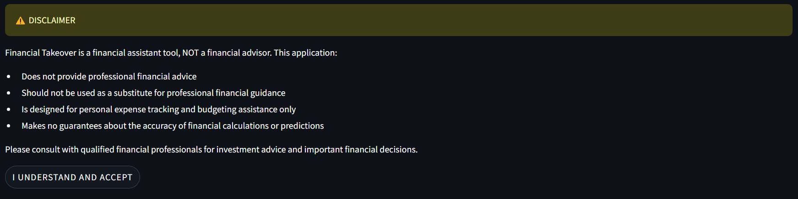

# Personal Expense Tracker and Budget Manager

<p align="center">
  
</p>

## Project Overview

This Streamlit-based expense tracker and budget management application helps users monitor their spending, set budgets, and analyze their financial habits. It provides an intuitive interface for tracking expenses, generating reports, and visualizing spending patterns.

<p align="center">
  
</p>

## Disclaimer

Financial Takeover is a financial assistant tool, NOT a financial advisor. This application:

* Does not provide professional financial advice
* Should not be used as a substitute for professional financial guidance
* Is designed for personal expense tracking and budgeting assistance only
* Makes no guarantees about the accuracy of financial calculations or predictions

Please consult with qualified financial professionals for investment advice and important financial decisions.


## Features

### Expense Tracking:

* Easy expense input with customizable categories
* Receipt image upload and processing
* Multiple currency support
* Transaction history with filtering options

### Budget Management:

* Monthly budget setting and tracking
* Category-wise budget allocation
* Alert system for budget thresholds
* Customizable spending categories

### Analytics and Reporting

* Interactive spending visualizations
* Monthly and yearly comparison charts
* Category-wise expense breakdown
* Exportable reports in multiple formats (CSV, Excel, JSON)

### Additional Features:

* Dark mode interface
* Data backup and restore
* Reciept Reader
* PDF report generation
* Multi-format export options

## Tech Stack

* Python: Core programming language
* Streamlit: Web interface framework
* Pandas: Data manipulation and analysis
* Plotly: Interactive visualizations
* Pillow: Image processing
* SQLite: Data storage

## Setup and Installation

### Prerequisites

* Python 3.7 or higher
* pip package manager

### Steps

1. Clone the repository:
```console
git clone https://github.com/investinjuju/Financial_Takeover.git
cd Financial_Takeover
```

2. Install dependencies:
```console
-r run_first.bat
```

3. Run the application:
```console
-r application.bat
```

## How to Use

<p align="left">
  
</p>

### Login

<p align="left">
  
</p>

### Using Navigation

* The Navigation Menu provides easy access to our different categories.
* Home, Transactions, Analytics, History, Settings, and Creators.
* The Backup Data feature allows you to save all your transaction history onto a PDF.

<p align="left">
  
</p>

### Adding Expenses

* Navigate to the "Add Expense" section
* Enter expense details (amount, category, date)
* Upload receipt image (optional)
* Submit the expense
* Clear expense to start over.

<p align="left">
  
</p>

### Viewing Reports

* Access the "Analytics" section
* Select date range for analysis
* View interactive charts and spending breakdowns
* Export reports in desired format

<p align="left">
  
</p>

### Transaction History

* Review and recall financial history
* Stores up to 5 previously cleared history

<p align="left">
  
</p>

### Managing Budgets

* Go to "Budget Settings"
* Set monthly budgets by category
* Monitor spending against budgets
* Receive alerts when approaching limits

## Known Issues

* Receipt image processing may be slow for large files
* Some charts may not render properly in mobile view
* Export functionality limited in size for free tier

## Future Enhancements

* Mobile app development
* Cloud sync capabilities
* AI-powered expense categorization
* Multiple user accounts support

## Contributors

* Julian Hernandez: [Github](https://github.com/investinjuju)
* Aiyana Estien
* Jose Aninat Brinck
* Buriel Noel
* Allyanna Payne
* Jesus Lara